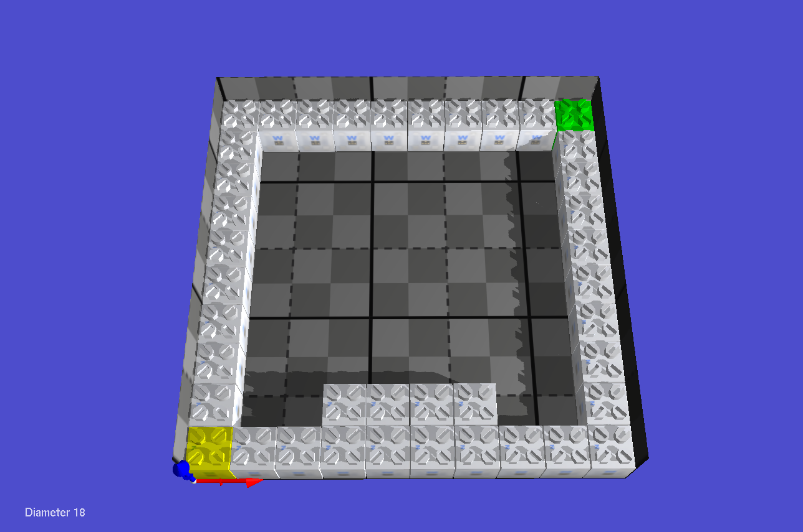
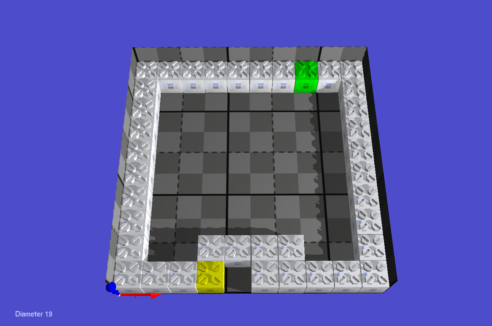
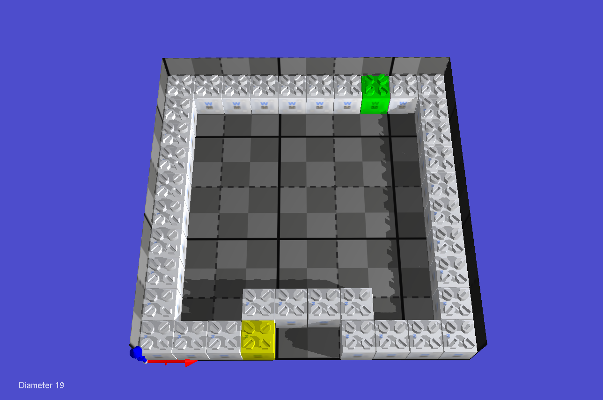
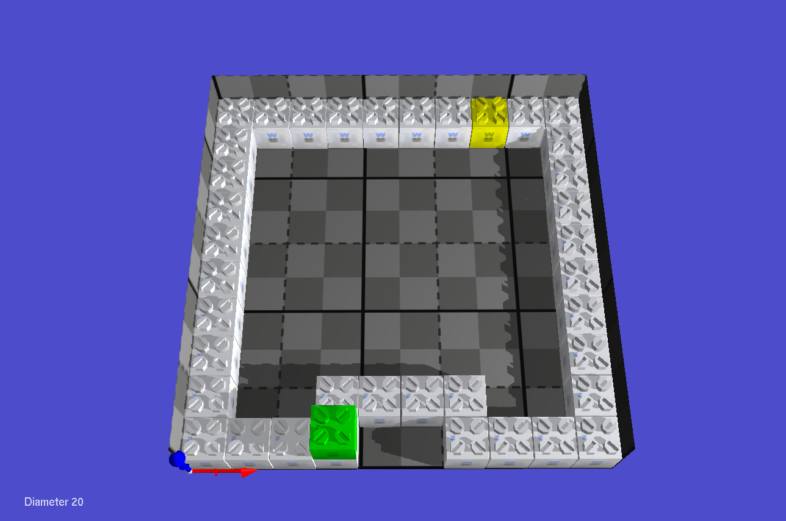
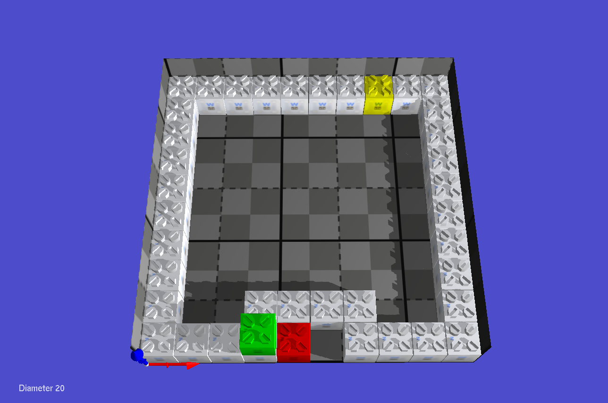
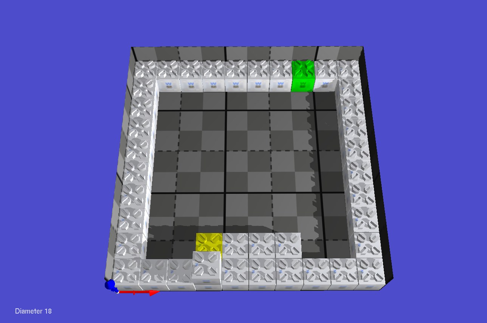

# Diameter Monitoring - Add/Remove Analysis

## 1. Initial Diameter Monitoring
Diameter monitoring complete at module 1
- **Diameter:** 18
- **Number of messages:** 2,563
- **Time:** 309,590
- **Cost Analysis:**
  - Messages: 2,563 (baseline)
  - Time: 309,590 (baseline)

---

## 2. Recalculation Due to Neighbor Removal
Diameter monitoring complete at module 4
- **Diameter:** 19
- **Number of messages:** 4,674
- **Time:** 638,940
- **Cost Analysis:**
  - Δ Messages: +2,111 (82% increase)
  - Δ Time: +329,350 (106% increase)
  - **Reason:** Network topology changed, full recalculation required

---

## 3. Diameter Stability
Diameter remains 19
- **Number of messages:** 4,695
- **Time:** 641,911
- **Cost Analysis:**
  - Δ Messages: +21 (0.4% increase)
  - Δ Time: +2,971 (0.5% increase)
  - **Reason:** Minimal overhead for stability verification

---

## 4. Growth Rule Applied
Diameter monitoring complete at module 38
- **New Diameter:** 20
- **Number of messages:** 5,240
- **Time:** 701,346
- **Cost Analysis:**
  - Δ Messages: +545 (11.6% increase from step 3)
  - Δ Time: +59,435 (9.3% increase)
  - **Reason:** New module added, diameter increased by 1

---

## 5. Stability Rule
Diameter remains 20
- **Number of messages:** 5,276
- **Time:** 705,846
- **Cost Analysis:**
  - Δ Messages: +36 (0.7% increase)
  - Δ Time: +4,500 (0.6% increase)
  - **Reason:** Stability check with minimal propagation

---

## 6. Bridge Rule Applied
Diameter monitoring fully complete at leaf 38
- **Final Diameter:** 18
- **Number of messages:** 7,097
- **Time:** 989,497
- **Cost Analysis:**
  - Δ Messages: +1,821 (34.5% increase from step 5)
  - Δ Time: +283,651 (40.2% increase)
  - **Reason:** Bridge formation optimized topology, diameter reduced by 2

---

## Summary Statistics
| Step | Diameter | Messages | Time | Msg Δ | Time Δ | Event |
|------|----------|----------|------|-------|--------|-------|
| 1 | 18 | 2,563 | 309,590 | - | - | Initial |
| 2 | 19 | 4,674 | 638,940 | +2,111 | +329,350 | Removal |
| 3 | 19 | 4,695 | 641,911 | +21 | +2,971 | Stability |
| 4 | 20 | 5,240 | 701,346 | +545 | +59,435 | Growth |
| 5 | 20 | 5,276 | 705,846 | +36 | +4,500 | Stability |
| 6 | 18 | 7,097 | 989,497 | +1,821 | +283,651 | Bridge |

**Total Cost:** 7,097 messages over 989,497 time units